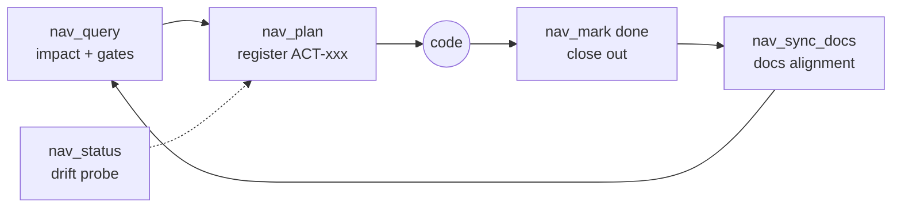

<div align="center">

# 🧭 dsh-project-nav

**Anti-drift project governance plugin for DeepSeek Harness (DSH)**

[](../../releases)
[](./LICENSE)
[](https://www.npmjs.com/package/@deepseek-ai/dsh-tools)
[](./package.json)

[简体中文](./README.md) | **English**

*Every task starts from architecture. Every file has a home. Everything is traceable.*

</div>

---

## Why

Long-running AI coding projects drift: files pile up without feature mapping, plans lose scope discipline, docs rot, and models keep patching the same corner because architecture was never the reference point.

**project-nav** closes that loop inside DSH: the agent maintains a workspace-level governance layer — every change passes the architecture gate and scope gate first, then gets closed out, aligned, and never left dangling.

## ✨ Features

- 🗺️ **Bidirectional governance map** — project→module→feature→file four-way cross index, single source of truth, one map for everything
- 🏛️ **Architecture doc layer (ecosystem, NOT in this package)** — L1 overview + L2 feature chains (through-style flow, line-number evidence) with fingerprint-expired auto-regeneration are provided by the companion arch-view skill; this repo ships the index + governance loop only
- 🏛️ **Architecture-first protocol** — a task must anchor to an architecture node before it enters the ledger; no anchor = architecture gap → revise architecture first; ≥3 patches on the same node force a full review
- 🎯 **Governance-first action ledger** — `nav_plan` → `begin` → change → `done` (with `abort`), single in-progress enforced, open actions = drift signal, marked red on the map
- 🧭 **Mainline vector with teeth** — doing / next / notDoing / exitCondition — plans colliding with `notDoing` are **hard-rejected**
- 📚 **Reference-docs foundation** — registered by `when` routing rules, recommended automatically at plan time
- 🔄 **Once-Only / SSOT** — hand-written `PROJECT.md` narrative stays untouched; `nav:auto` marked sections are auto-derived
- 🌳 **Progressive mindmap** — self-contained offline HTML, no CDN, double-click to open
- 🩺 **Disk drift probe** — files registered but missing on disk (STALE) surfaced at a glance, dual path-shape compatible

## 🔧 The 12 tools

| Tool | Purpose |
|------|---------|
| `nav_query` | Look up structure/modules/features before changes (scope gate + mainline warning) |
| `nav_plan` | Governance-first gate: register action (scope pre-check + anti-goal hard rejection) |
| `nav_mark` | Action lifecycle: begin / done / abort |
| `nav_update` | Incremental feature ↔ file mapping updates |
| `nav_add_feature` / `nav_add_module` | Register feature / module (orphan hints, dual-mount warnings) |
| `nav_add_doc` / `nav_docs` | Register / query reference docs (dead links rejected) |
| `nav_map` | Governance map: `text` (agent orientation) / `html` (human mindmap) |
| `nav_sync_docs` | Auto-align PROJECT.md (marked sections derived) |
| `nav_status` | Health snapshot: coverage + open actions + STALE files |
| `nav_set_vector` | Set the mainline vector |

## 🔄 Governance loop



## 🏛️ Three-layer model

| Layer | Artifact | Audience |
|-------|----------|----------|
| Index | `<root>/.internal/nav-index.json` (four-way maps, atomic writes) | machines (tool queries) |
| Architecture docs (ecosystem) | `<root>/.internal/arch/*.md` (maintained by the companion arch-view skill, not in this package) | agents + humans |
| Render | nav_map HTML (generated by this package) | humans (view only, never written back) |

## 📦 Install

```bash
pnpm pack
dsh plugin --profile web add "@dsh-external/project-nav@file:<tgz path>"
```

Peer dependency: `@deepseek-ai/dsh-tools` (pinned `0.1.2-rc.1`); Node ≥ 18.

## ⚙️ Configure `root` (important)

`root` decides which workspace the plugin governs — all data lives in `.internal/` under it.
`root` has **no machine-specific default**: when unset it falls back to the DSH process working directory (cwd), and the boot log prints the effective root at warn level.

Add a `config` block to the plugin entry in your profile's patch layer (e.g. `~/.dsh/profiles/<profile>/cordis.patch.yml`):

```yaml
- id: project-nav
  config:
    root: 'C:/path/to/your/workspace'   # the governed workspace that holds PROJECT.md
```

Restart the profile after configuring. Always confirm the root shown in the boot log before using the `nav_*` tools.

## 🗃️ Data

Single source of truth at `<root>/.internal/` (nav-index / vector / nav-actions / nav-docs); everything else is derived — **zero per-project config other than `root`**. Index and data files stay out of git (`.gitignore`); data surgeries always back up first. `.internal/arch/*.md` is maintained by the companion arch-view skill and is not part of this package's data flow.

## 🛠️ Development

```bash
pnpm install
pnpm test      # node --test (real regression suite: test/core.test.mjs, all in temp dirs — never touches a real workspace)
pnpm pack      # build publishable tarball
```

Publish cycle: bump version → `pnpm pack` → `dsh plugin --profile web add "@dsh-external/project-nav@file:<tgz>"` → restart dsh-web (don't forget `config.root`, see above).

Full engineering journal in [HANDOFF.md](./HANDOFF.md) (§1–§27: decisions, data surgeries, closure audits).

## 📄 License

[BSD-3-Clause](./LICENSE) © 2026 Fishsb
