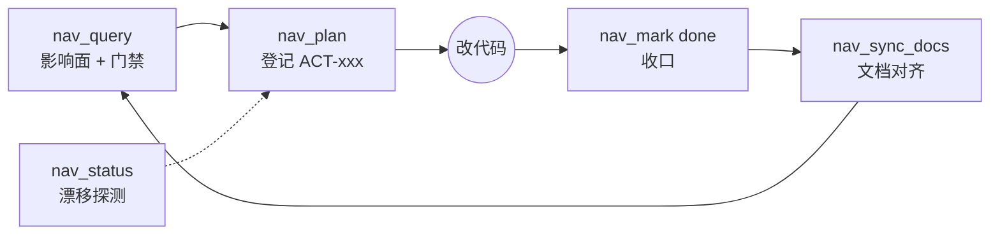

<div align="center">

# 🧭 dsh-project-nav

**面向 DeepSeek Harness（DSH）的项目反漂移治理插件**

[](../../releases)
[](./LICENSE)
[](https://www.npmjs.com/package/@deepseek-ai/dsh-tools)
[](./package.json)

**简体中文** | [English](./README.en.md)

*每个任务从架构出发 · 每个文件都有落点 · 一切皆可回溯*

</div>

---

## 为什么需要

AI coding 的长期项目会漂移：文件越堆越多却没有功能映射、方案失去范围约束、文档烂尾、模型在架构空白处反复打补丁。

**project-nav** 在 DSH 内闭合这个循环：agent 自己维护一套工作区级治理层——改任何东西之前先过架构门与范围门，改完之后收口、对齐、不留悬空状态。

## 🧭 设计原则：以架构为核心，其余为辅助（v0.6.0 收敛）

- **核心（不可省）**：索引（架构真相）+ **锚点闸**（动手前先做架构思考）+ **ADR**（架构决策留痕）+ **计数闸**（同一锚点反复补丁 → 强制回架构层）。
- **辅助（够用即止）**：并发租约与排队、scope 文件指纹、文档自动派生、参考文档路由、地图渲染——它们服务核心，不另立门槛。
- **复杂度预算（唯一裁剪标准：模型是否必须多读/多记/多遵循）**：
  - 能推导的**不另建账本** —— 补丁 = 带锚点的 `done` 动作，`nav-patches.json` 已废除；
  - 能合并的**不另开工具** —— 功能/模块注册与字段更新合并为 `nav_update`（upsert），参考文档注册与检索合并为 `nav_docs`；
  - 能推断的**不强制参数** —— 单目标 scope 自动取锚，只有多目标/歧义时才要求 `anchor=`。
- **为什么**：治理插件本身也是被模型读的代码。太复杂 → 不聪明的模型读不了也遵循不了；聪明的模型不需要过多强限制。

## ✨ 核心能力

- 🗺️ **双向治理地图**：项目→模块→功能→文件 四维交叉索引，单一数据真身，一张图看清全部结构
- 🏛️ **架构文档层接入治理循环（v0.8.0）**：架构档（`.internal/arch/*.md`，头部带 `arch-cache` 指纹块：声明本档读的是哪些文件的哪一版）不再只靠 agent 自觉——`nav_query` 查询目标时附**架构档指针行**（新鲜 / 过期 / 无档软提示）、`nav_plan` 记 `archBasis` 并输出**架构对照**段（落点 / 波及 / 状态）、`nav_mark done` 报**本次改动使哪几档过期**、`nav_status` 汇总全档新鲜度、`nav_arch` 负责列出 / 覆盖校验 / 指纹刷新。**渲染（SVG/HTML 投影）不进插件**：投影零维护，仍由配套 arch-view 技能侧脚本产出；本仓库只负责「档在哪、还新鲜吗、覆盖不覆盖这个目标」三件可机检的事
- 🏛️ **架构先行协议（v0.5.0 起）**：任务必须锚定架构节点才入账——单目标 scope 自动取锚，多目标必须显式 `anchor=`；同锚点自最近架构决策以来 ≥3 次**补丁** → **计数闸**强制回架构层；`nav_adr` 记录架构决策并重置计数。**「补丁」只认真的动过东西**（v0.7.3）：done 时指纹证明 scope 内文件一个都没变的验证/记账动作不计入——否则会逼出没有架构内容的 ADR，ADR 通胀后核心决策账本就成噪音
- 🎯 **治理事务环**：`nav_plan` → `begin` → 改动 → `done`（abort 兜底），未完成动作 = 漂移信号，地图标红；**每会话同时只允许一个 in_progress**
- 🧵 **多会话并发（v0.3.0）**：锁的粒度是 **scope 而不是工作区**——不相交的会话真并行干活，只有 scope 相交（同功能 / 同模块 / 同文件 / 索引派生出的同一文件）才排队；`nav_mark begin wait=true` 可阻塞等待，崩溃会话的租约自动过期自愈，账本带跨进程文件锁（并发立项不再丢动作）
- 🔍 **scope 文件指纹（v0.4.0）**：`begin` 记录 scope 内每个文件的 size/mtime/sha1，`done` 比对并报 `⚠ Scope drift`（被改/被删/新出现三类），运行中动作由 `nav_status` 实时显示漂移——租约防「同时开工」，指纹防「开工期间被别人动过」。**v0.7.4 修正**：按功能/模块声明 scope 时不再误删 workspace 相对的索引键（此前 12/18 个功能的指纹恒为空 = 静默失效），且「本来就不存在的文件」不再被误报 vanished
- 🔒 **共享状态写入串行化（v0.7.0）**：索引 / 参考文档 / 向量 / 架构决策账本 / `PROJECT.md` 的每个读改写都在**按目标文件的互斥锁**下进行（锁目录 `.internal/locks/`）——两个会话同时写不再互相覆盖（这正是此前索引被反复回退的根因）；锁等待异步化（不再阻塞事件循环），持有者崩溃时按锁文件 mtime 破锁
- 🗑️ **索引退役语义（v0.7.1）**：`nav_update retire=true` 是 upsert 的逆操作——被删除的功能/模块/项目可以从索引里**真正退役**（级联清理双向映射）。没有它，索引只能增不能删，任何删除都留下**永久假 STALE**，而假警报会让模型学会忽略漂移信号（本工作区实测：`nav_status` 从 7 条假警报回到 `Stale files: none`）
- 🧭 **主线向量带牙齿**：doing / next / notDoing / exitCondition——方案撞上"不做什么"**直接拒绝立项**
- 📚 **参考文档地基**：按 when 路由规则注册，方案确认时自动推荐该读什么
- 🔄 **Once-Only / SSOT**：手写 `PROJECT.md` 叙事不动，`nav:auto` 标记区自动派生
- 🌳 **渐进式导图**：自包含离线 HTML 思维导图，无 CDN、双击即开
- 🩺 **磁盘漂移探测**：索引里有、磁盘上没有（STALE）一览无余，双路径形态兼容

## 🔧 工具一览（11 个，单一职责）

| 工具 | 作用 |
|------|------|
| `nav_query` | 查结构/模块/功能，改动前理解范围（范围门禁 + 主线告警 + **跨会话占用提示** + **架构档指针行**） |
| `nav_plan` | 治理优先门禁：登记动作（**锚点闸** + 范围预校验 + 反目标硬拦截 + **计数闸** + **架构对照段与 archBasis**） |
| `nav_mark` | 事务生命周期 begin / done / abort（begin 含 scope 冲突闸 + 租约 + 排队；done 报 scope 漂移、计数压力与**本次改动使哪几档架构档过期**）。**租约过期不是死路**（v0.7.4）：其 owner 仍可 `begin` 重取锁并重拍指纹、`done` 迟收口（记 `lateCompletion`）或 `abort` |
| `nav_adr` | **架构决策记录**（锚点 + 触发原因 + 决策 + 影响面）；登记即重置该锚点补丁计数 |
| `nav_arch` | **架构文档层**：`list`（全档新鲜度 / 过期管理）、`check`（某目标由哪些档覆盖、是否新鲜）、`stamp`（按档内已声明的 files 列表重取指纹——内容由 agent 重生成，指纹由工具写）。除 stamp 外全程只读，从不改写正文 |
| `nav_update` | **唯一登记口（upsert 与退役）**：更新已存在条目，或直接创建功能/模块（新功能给 `files=`，新模块给 `features=`/`project=`）；条目真正从工作区消失时用 `retire=true` 退役并级联（功能清双向文件映射 + 模块成员；模块摘除项目挂载但保留其功能；项目摘除模块但保留之），在飞动作仍引用该目标时拒绝。**模块可迁移**（v0.7.4）：已有模块给 `project=` 即换挂载，`project=""` 摘除（退役项目后「re-home」不再是空话） |
| `nav_docs` | 参考文档：给 `title`+`path`+`when` 即登记（`when` 是路由规则），否则列库 / 按 `task` 排序推荐。相对路径按**被治理 root** 解析（v0.7.4），不受进程 cwd 影响 |
| `nav_map` | 治理地图：`text`（agent 导航）/ `html`（人看导图）；`target` 按名称收窄（v0.7.4 起 text 与 html 一致生效，原 `level` 死参数已移除） |
| `nav_sync_docs` | 自动对齐 PROJECT.md（标记区派生：功能地图 + 主线向量 + **架构决策**） |
| `nav_status` | 健康快照：覆盖度 + 未完成动作 + STALE 文件 + **跨会话并发视图** + **架构决策与计数闸压力** + **架构档新鲜度汇总**（v0.8.0） |
| `nav_set_vector` | 设置主线向量 |

## 🔄 治理循环



## 🏛️ 三层模型

| 层 | 载体 | 读者 |
|----|------|------|
| 索引层 | `<root>/.internal/nav-index.json`（四维映射 + 原子写） | 机器（工具查询） |
| 架构文档层（生态配合） | `<root>/.internal/arch/*.md`（由配套 arch-view 技能维护，不在本包） | agent + 人 |
| 渲染层 | nav_map HTML（本包生成） | 人（只看不写回） |

## 📦 安装

```bash
pnpm pack
dsh plugin --profile web add "@dsh-external/project-nav@file:<tgz 路径>"
```

依赖：`@deepseek-ai/dsh-tools`（peer，`>=0.1.2-rc.1 <0.2.0`——与生态其他插件同写区间而非精确锁，本机验证于 0.1.5-rc.1）；Node ≥ 18。

## ⚙️ 配置 root（重要）

插件治理哪个工作区由 `root` 决定——被治理目录下的 `.internal/` 存放全部数据。
`root` **没有机器相关默认值**：未配置时回退到 DSH 进程的工作目录（cwd），启动日志会以 warn 打印实际生效的 root。

在 profile 的 patch 层（如 `~/.dsh/profiles/<profile>/cordis.patch.yml`）给插件条目补 `config`：

```yaml
- id: project-nav
  config:
    root: 'C:/path/to/your/workspace'   # 指向含 PROJECT.md 的被治理工作区
```

配置后重启 profile 生效。启动日志中显示的 root 就是要被治理的目录——请确认它符合预期再开始用 `nav_*` 工具。

可选 `leaseTtlMs`（默认 30 分钟）：会话崩溃后其 scope 锁在此之前保持有效，超时自动过期释放。

## 🗃️ 数据

单一数据真身 `<root>/.internal/`（nav-index / vector / nav-actions / nav-docs / nav-arch），其余全部自动派生——**除 `root` 外零每项目配置**。索引与数据文件不进 git（`.gitignore`），数据手术一律先备份。`.internal/arch/*.md` 由配套 arch-view 技能维护，不在本包数据流内。

## 🛠️ 开发

```bash
pnpm install
pnpm test      # node --test test/core.test.mjs test/concurrency.test.mjs（74 项真实回归，全部在临时目录跑，不碰真实工作区）
pnpm pack      # 构建发布包
```

发布循环：bump version → `pnpm pack` → `dsh plugin --profile web add "@dsh-external/project-nav@file:<tgz>"` → 重启 dsh-web（记得补 `config.root`，见上）。

工程日志见 [HANDOFF.md](./HANDOFF.md)（§1–§27：决策 / 数据手术 / 闭环审查全记录）。

## 📄 License

[BSD-3-Clause](./LICENSE) © 2026 Fishsb
