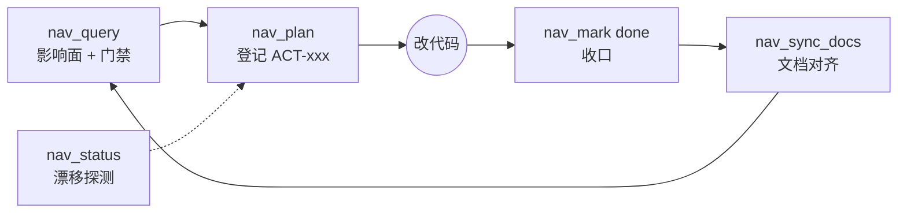

<div align="center">

# 🧭 dsh-project-nav

**面向 DeepSeek Harness（DSH）的项目反漂移治理插件**

[](../../releases)
[](./LICENSE)
[](https://www.npmjs.com/package/@deepseek-ai/dsh-tools)
[](./package.json)

**简体中文** | [English](./README.en.md)

*每个任务从架构出发 · 每个文件都有落点 · 一切皆可回溯*

</div>

---

## 为什么需要

AI coding 的长期项目会漂移：文件越堆越多却没有功能映射、方案失去范围约束、文档烂尾、模型在架构空白处反复打补丁。

**project-nav** 在 DSH 内闭合这个循环：agent 自己维护一套工作区级治理层——改任何东西之前先过架构门与范围门，改完之后收口、对齐、不留悬空状态。

## ✨ 核心能力

- 🗺️ **双向治理地图**：项目→模块→功能→文件 四维交叉索引，单一数据真身，一张图看清全部结构
- 🏛️ **架构文档层（生态配合，不在本包内）**：L1 项目总览 + L2 特征主链（贯通式流程、行号级证据）、指纹过期自动重生成，由配套的 arch-view 技能提供——本仓库只交付索引与治理闭环
- 🏛️ **架构先行协议**：任务必须锚定架构节点才入账；无锚点 = 架构不足 → 先修架构再开发；同节点 ≥3 次修补强制回架构层整体审视
- 🎯 **治理事务环**：`nav_plan` → `begin` → 改动 → `done`（abort 兜底），单 in_progress 强制，未完成动作 = 漂移信号，地图标红
- 🧭 **主线向量带牙齿**：doing / next / notDoing / exitCondition——方案撞上"不做什么"**直接拒绝立项**
- 📚 **参考文档地基**：按 when 路由规则注册，方案确认时自动推荐该读什么
- 🔄 **Once-Only / SSOT**：手写 `PROJECT.md` 叙事不动，`nav:auto` 标记区自动派生
- 🌳 **渐进式导图**：自包含离线 HTML 思维导图，无 CDN、双击即开
- 🩺 **磁盘漂移探测**：索引里有、磁盘上没有（STALE）一览无余，双路径形态兼容

## 🔧 工具一览（12 个）

| 工具 | 作用 |
|------|------|
| `nav_query` | 查结构/模块/功能，改动前理解范围（含范围门禁 + 主线告警） |
| `nav_plan` | 治理优先门禁：改动前登记动作（范围预校验 + 反目标硬拦截） |
| `nav_mark` | 事务生命周期 begin / done / abort |
| `nav_update` | 登记功能↔文件映射增量 |
| `nav_add_feature` / `nav_add_module` | 注册功能 / 模块（含孤儿提示、双挂载警告） |
| `nav_add_doc` / `nav_docs` | 注册 / 检索参考文档（本地死链拒绝） |
| `nav_map` | 治理地图：`text`（agent 导航）/ `html`（人看导图） |
| `nav_sync_docs` | 自动对齐 PROJECT.md（标记区派生） |
| `nav_status` | 健康快照：覆盖度 + 未完成动作 + STALE 文件 |
| `nav_set_vector` | 设置主线向量 |

## 🔄 治理循环



## 🏛️ 三层模型

| 层 | 载体 | 读者 |
|----|------|------|
| 索引层 | `<root>/.internal/nav-index.json`（四维映射 + 原子写） | 机器（工具查询） |
| 架构文档层（生态配合） | `<root>/.internal/arch/*.md`（由配套 arch-view 技能维护，不在本包） | agent + 人 |
| 渲染层 | nav_map HTML（本包生成） | 人（只看不写回） |

## 📦 安装

```bash
pnpm pack
dsh plugin --profile web add "@dsh-external/project-nav@file:<tgz 路径>"
```

依赖：`@deepseek-ai/dsh-tools`（peer，精确锁 `0.1.2-rc.1`）；Node ≥ 18。

## ⚙️ 配置 root（重要）

插件治理哪个工作区由 `root` 决定——被治理目录下的 `.internal/` 存放全部数据。
`root` **没有机器相关默认值**：未配置时回退到 DSH 进程的工作目录（cwd），启动日志会以 warn 打印实际生效的 root。

在 profile 的 patch 层（如 `~/.dsh/profiles/<profile>/cordis.patch.yml`）给插件条目补 `config`：

```yaml
- id: project-nav
  config:
    root: 'C:/path/to/your/workspace'   # 指向含 PROJECT.md 的被治理工作区
```

配置后重启 profile 生效。启动日志中显示的 root 就是要被治理的目录——请确认它符合预期再开始用 `nav_*` 工具。

## 🗃️ 数据

单一数据真身 `<root>/.internal/`（nav-index / vector / nav-actions / nav-docs），其余全部自动派生——**除 `root` 外零每项目配置**。索引与数据文件不进 git（`.gitignore`），数据手术一律先备份。`.internal/arch/*.md` 由配套 arch-view 技能维护，不在本包数据流内。

## 🛠️ 开发

```bash
pnpm install
pnpm test      # node --test（真实回归：test/core.test.mjs，全部在临时目录跑，不碰真实工作区）
pnpm pack      # 构建发布包
```

发布循环：bump version → `pnpm pack` → `dsh plugin --profile web add "@dsh-external/project-nav@file:<tgz>"` → 重启 dsh-web（记得补 `config.root`，见上）。

工程日志见 [HANDOFF.md](./HANDOFF.md)（§1–§27：决策 / 数据手术 / 闭环审查全记录）。

## 📄 License

[BSD-3-Clause](./LICENSE) © 2026 Fishsb
